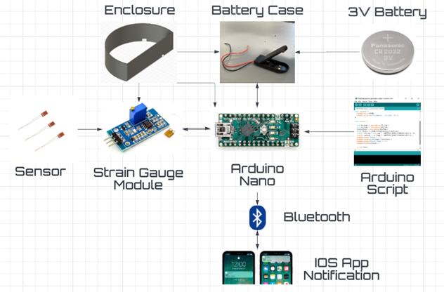
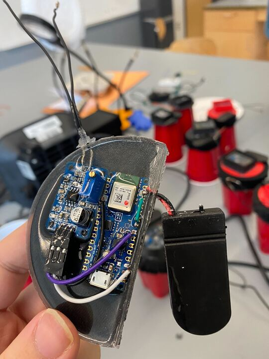

<h1 align="center">Engineering Addendum</h1>

<b>Team 23</b>

Zirui Chen

Alan Dautov

Gabrielle Kuntz

Pengyu Wu

Chenyuan Zhao

 

## Navigation

<!-- TABLE OF CONTENTS -->

  
Table of Contents

  <ol>
    <li>
      <a href="#engineering-addendum">Title</a>
    </li>
    <li>
      <a href="#project-overview">Project Overview</a>
    </li>
    <li>
      <a href="#repositories">Repositories</a>
    </li>
    <li>
      <a href="#current-status">Current Status</a>
    </li>
    <li>
      <a href="#future-work">Future Work</a>
    </li>
  </ol>

 

## Project Overview

In recent years, the occurrence of drink spiking has increased globally, with college students being the primary targets. Drink spiking involves surreptitiously adding drugs or other substances to someone's drink without their knowledge or consent, which can have serious short and long-term health consequences, including memory loss, inability to speak, and blurred vision.

To address this issue and prevent drink spiking incidents, we have developed the Halo Smart Drink Protector, a battery-powered device that can seal the top of common glass types. It is a portable and user-friendly device that aims to offer a proactive solution to the problem. Halo's innovative features include a detection algorithm with a high success rate and a flexible and adjustable cover that fits various cup sizes. The device is easy to use and can be carried around, making it a convenient option for people who want to prevent drink spiking. We hope that the Halo Smart Drink Protector will be accessible and affordable to everyone who wants to prevent the potential harm caused by drink spiking.
 

The final product consists of four primary components, which are the Arduino nano 33 BLE, the outer layer cover, an app, and strain gauge sensor. The Arduino has two built-in sensors, a gyroscope and an accelerometer, which can sense rotations and acceleration, and a strain gauge with the amplifying module connected to it. By combining the accelerometer and gyroscope with the strain gauge module, Halo is able to recognize and detect potential cover removals and eliminate false positives, such as simple cup movement. The Arduino is equipped with a Bluetooth module that is capable of sending signals and connecting to the iOS app, which will send a notification to the user whenever the device senses a potential cover removal.

 

(<a href="#navigation">to table of contents</a>)

## Repositories

Two repositories in addition to this one. One contains the Arduino code and the other contains the code for the iOS app.

* <a href="https://github.com/dautal/Halo-Smart-Drink-Protector">Arduino Code</a>
  * Short description words words words words words words words words words words words words words words words words words words words words words words words words words words.

* <a href="https://github.com/dautal/HaloApp">iOS App Code</a>
  * Short description words words words words words words words words words words words words words words words words words words words words words words words words words words.

## Challenges Faced
### Strain Gauge
A strain gauge is a device used to measure the strain or deformation of an object. It works on the principle that when a metal wire or foil is stretched, its resistance changes in proportion to the amount of strain. Strain gauges are extremely fragile and require careful installation and bonding to the surface of the object being measured. Any errors in the installation process can break the straing gauge or lead to innacurate readings. Additionally, the strain gauge must be mounted in a way that allows it to measure the strain in the desired direction. With these challenges, numerous strain gauges were broken and new ones needed to be resoldered to the amplifier module.
### Voltage Amplifier Module
A voltage amplifier is required for strain gauge measurements because the output signal of a strain gauge is typically very small, typically in the microvolt range. This small signal is difficult to measure directly, as it can be easily overwhelmed by noise and other electrical interference. The problem we faced is that for some reason not every amplifier actually works as intended. Some of them provided random negative values and the potentiometer did not work at all. We recommend using the certain amplifier module, which is listed in the Hardware Report. 
### Cloth Cover
Words words words words words words words words words words words words words words words words words words words words words words words words words words words words words words words words words.

## Current Status
### Hardware
Words words words words words words words words words words words words words words words words words words words words words words words words words words words words words words words words words words words words words words words words words words words words words words words words words.
Words words words words words words words words words words words words words words words words words words words words words words words words words words words words words words words words words words words words words words words words words words words words words words words words words words words words words words words words words words words words words words words words words words words words words words words words words.

### Software
Words words words words words words words words words words words words words words words words words words words words words words words words words words words words words words words words words words words words words words words words words words words words words words words words words words words words words words words words words words words words words words words words words words words words words words words words words words words words words words words words words words words words words words words words words words words words words words words words words words words words words words words words words words words words words words words words words words words words words words words words words words words words words words.
 

(<a href="#navigation">to table of contents</a>)

## Future Work

One of the next steps would be to make the product more accessible to consumers, since right now a the unit cost of a signle Halo device is around $40. The desirable unit cost which the Halo team wants to achieve should be in the $20-$25 range. An approach to reduce the price of the device is to integrate all the components onto a PCB. This approach not only reduces the size and weight of the device, but it also helps lower the cost of manufacturing. By optimizing the design of the PCB, the number of components required can be reduced, leading to a reduction for the overall cost of each unit. Additionally, with fewer components, the manufacturing process will be simplified, leading to a reduction in assembly cost. 

Another step would be to improve the iOS app functionality and design. Right now the iOS app is capable of connecting to the device, show the current status, 

 

(<a href="#navigation">to table of contents</a>)

